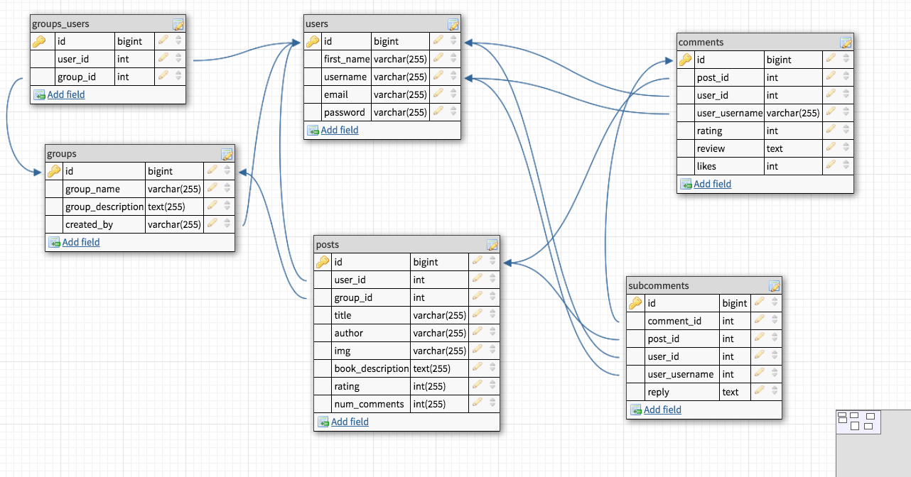

#Welcome to Remote Read, a digital book club by Alessa

Remote Read is a simple forum for book lovers who want to post and discuss their book club selections online. Remote Read allows a user to post a book along with a cover photo, description, and initial rating. Other users can comment on that post, and even reply to other comments. 

##Approach 

*please see img directory for more wireframes*

## User Stories
    *As a user I should be able to see all the books that have been posted, and their basic information.
    *As a user I should be able to scroll down to read a long book description, directly on the index page. 
    *As a user I should be able to see how many comments a post has, from the index page.
    *As a user I should be able to add a new book post. 
    *As a user I should be able to not submit a description with a post if I chose. 
    *As a user I should be able to edit a post. 
    *As a user I should be able to delete a post. 
    *As a user I should be able to see previously entered information when editting a post. 
    *As a user I should be able to comment on posts. 
    *As a user I should be able to delete my comments. 
    *As a user I should be able to reply to comments. 
    *As a user I should be able to delete my reply. 

## Technologies Used

*HTML/CSS
*JavaScript
*Node.js
*Express.js
*Node packages

## Obstacles 

Creating subcomments and getting them to display only for their corresponding comment. 

Getting my DOM Manipulation to work only on the div inside the specific comment that corresponds to the button. 

## Unsolved Problems 

Getting my ratings select to pre-populate in the Edit page. 

## Future Goals

I would like to have the Ratings in a post be re-calculated every time a comment is added, to be the average of the Ratings in all of its comments. 

I would like to be able to edit comments and subcomments. 

I would like to make my show page responsive. 

